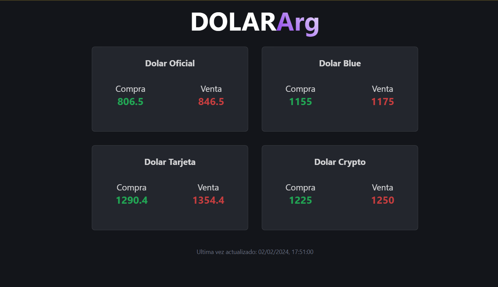

# A cuanto esta el dólar?

Una web hecha con Astro para recuperar los datos de los precios de los diferentes tipos de cambio del dólar.



## 🟠🟡 Estructura del proyecto

```text
/
├── public/
│   └── dolar-icon.svg
├── src/
│   ├── components/
│   │   └── DolarCard.astro
│   ├── layouts/
│   │   └── Layout.astro
│   └── pages/
│       └── index.astro
└── package.json
```

## 🧞 Comandos


| Command                   | Action                                           |
| :------------------------ | :----------------------------------------------- |
| `pnpm install`             | Installs dependencies                            |
| `pnpm run dev`             | Starts local dev server at `localhost:4321`      |
| `pnpm run build`           | Build your production site to `./dist/`          |         |
